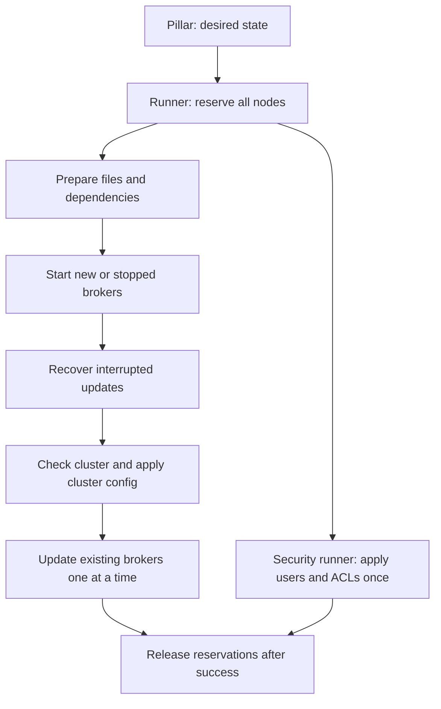

# Redpanda with Salt

This extension installs Redpanda and reconciles its configuration with the desired state.
Users and Kafka ACLs are managed separately, without restarting brokers.

Requires Linux/systemd, Salt 3007/3008, and Debian/Ubuntu or a RedHat-family distribution.
Salt and the VMs must already exist.

## Getting started

1. Add this repository's `salt/` directory to the Salt master's `file_roots.base`.
2. Use the [example pillar](pillar/redpanda.example.sls), specify the version and **all** cluster nodes.
3. Assign the pillar to minions through `pillar/top.sls`. The `nodes` keys must be exact minion IDs.
4. Prepare `cluster-pillar.json`: an object containing `{"redpanda": {...}}` with the same settings.

Minimal pillar:

```yaml
redpanda:
  version: '25.3.1'  # Use the exact package version for your distribution.
  enable_tls: true
  kafka_enable_authorization: true
  sasl: {username: admin, password: '<from protected pillar>'}
  tls:
    ca_source: salt://private/redpanda/truststore.pem
    cert_source: salt://private/redpanda/node.crt
    key_source: salt://private/redpanda/node.key
  nodes:
    broker-1: {private_ip: 10.0.0.11}
    broker-2: {private_ip: 10.0.0.12}
    broker-3: {private_ip: 10.0.0.13}
```

Set each broker's certificate and key through `nodes.<minion>.overrides.tls`.
SASL without TLS is rejected; `allow_insecure_sasl: true` is only for isolated test environments.

```sh
salt-run saltutil.sync_runners
salt-run redpanda_rollout.deploy pillar="$(cat cluster-pillar.json)"
# Apply sasl_users and sasl_acls separately.
salt-run redpanda_rollout.users pillar="$(cat cluster-pillar.json)"
```

Pass secrets through protected pillar; do not commit them to the repository.
Run pillar is accessible to the master, job cache, and authorized Salt operators.
Security runs require the current SASL/TLS/listener settings; no package version is required.
Direct `state.apply` without a runner reservation is unsupported.

## Deployment flow



A running broker with no changes is not restarted.
When changes are needed: health → maintenance/drain → safety checks → packages/config → restart → readiness/health.
The next node is updated only after the previous one succeeds.
Runner `test=True` validates inventory only; there is no full deployment preview.

## Recovering a failed run

Reservations and `/var/lib/redpanda-salt/pending.json` remain; subsequent nodes are not updated.
A broker may remain in maintenance mode or under a runtime mask.

1. Fix the cause. Make sure all running **and queued** master/minion jobs have finished or been cancelled.
2. Release reservations using the token reported in the failure:

```sh
salt-run redpanda_rollout.unlock nodes='["broker-1","broker-2","broker-3"]' token='<token>'
```

3. Repeat the original runner. Do not delete `pending.json`: it is required for recovery.

## Settings and limitations

| Purpose | Pillar |
|---|---|
| Broker / cluster configuration | `node` / `cluster` |
| Per-node settings | `nodes.<minion>.overrides` |
| TLS / SASL | `enable_tls`, `tls` / `kafka_enable_authorization`, `sasl` |
| Users / Kafka ACLs | `sasl_users` / `sasl_acls` |
| Disks, offline packages, FIPS | Explicitly enabled in the [example](pillar/redpanda.example.sls) |

Disks are not formatted by default. RAID0/XFS is only used for explicitly specified dedicated devices.
Deleting existing data is unsupported.
The probe requires Redpanda 25.1+; for older versions, `restart_probe: false` leaves only health checks.
By default, any partition risks, including RF=1, block rolling restarts; a single broker has downtime during a restart.
TLS, administrator credential, and cluster membership migrations are performed separately.

[Code guide](docs/architecture.md) · [Configuration rules](docs/configuration.md) · [Validation](docs/acceptance.md)

## Tests

```sh
python3 -m venv .venv
.venv/bin/pip install -r requirements-test.txt
.venv/bin/pytest -q
```

Tests cover logic, the Salt loader, SLS, and local `salt-call`.
Real restarts and fault tolerance are tested on a separate VM environment; provisioning is not included.

Apache-2.0: [LICENSE](LICENSE), [NOTICE](NOTICE). Implementation source: [Ansible collection audit](docs/ansible-collection-audit.md).
