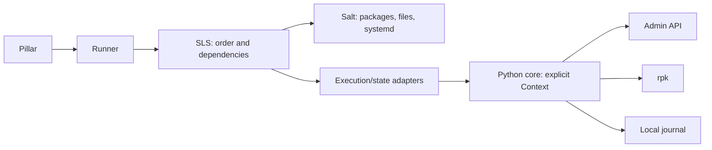

# Code guide

Start with the two entry points: `redpanda_rollout.deploy` and `redpanda_rollout.users`.
The runner reserves the inventory; SLS defines the order; Python performs one operation.

| Location | Responsibility |
|---|---|
| `salt/_runners/redpanda_rollout.py` | Deploy/security entry points, reservations, unlock |
| `salt/redpanda/orch/` | Bootstrap, recovery, broker order |
| `salt/redpanda/redpanda_broker/apply.sls` | Update sequence for one broker |
| `salt/redpanda/users/` | Validate inventory, apply users and ACLs |
| `salt/_modules/redpanda.py` | Pillar → Context; operation authorization and safe results |
| `salt/_states/redpanda_broker.py` | Python result → Salt `result/changes/comment` |
| `salt/_modules/redpanda_lock.py` | Durable minion reservation |
| `salt/_utils/redpanda/` | Ordinary Python package containing the logic |

Inside the package:

| File | Contents |
|---|---|
| `config.py` | Merge defaults/pillar, validate, build YAML |
| `admin.py` | HTTP, TLS/SASL, redirects, old endpoints during migration |
| `rpk.py` | Execute argv without a shell; avoid exposing credentials |
| `security.py` | SCRAM users, internal service accounts, Kafka ACLs |
| `cluster.py` | Cluster config, propagation, license |
| `lifecycle.py` | Update plan, maintenance, restart, readiness |
| `journal.py` | Read/write checkpoints and tracking files |
| `storage.py` | Validate UUID, topology, and absence of root/foreign volumes |
| `context.py` | Settings, I/O, and completed changes for one operation |

Each operation receives `ctx` as an argument. Salt globals are confined to the adapters;
the package has no ContextVar, global lookups, or callbacks into the execution module.
`__init__.py` exposes the package to the loader; `saltutil.sync_all` delivers it to minions.
Public Salt modules need a prefix; internal files have short names.

## One operation

**Validate input → read actual state → compare desired state → apply the delta → verify the result.**
The SCRAM API does not return passwords: explicit rotation is tracked by digest.
For unavailable facts, the code does not invent comparisons or promise to detect external changes.

SLS defines operation order. Python rechecks safety immediately before a restart.
A checkpoint records progress but does not replace a fresh health check.
Repeated deployment reruns the checks; failed operations retain partial changes and the journal.

## Tests

`test_configuration`, `test_admin`, `test_cluster`, `test_storage`, `test_security`,
`test_lifecycle_phases`, and `test_review_regressions` cover the corresponding operations.
`test_rollout` covers reservations; `test_state_contract` covers Salt returns.
`test_render`, `test_salt_graph`, `test_native_salt`, and `test_functional_salt` cover SLS, the loader, and dispatch.
`support.py` adapts legacy mocks to an isolated Python package; production code does not use it.
